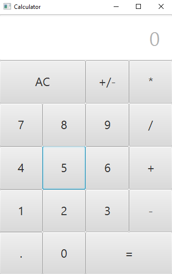

## <ins>Introduction</ins>

A calculator done with [Java FX](https://openjfx.io/) and [Scene builder](https://gluonhq.com/products/scene-builder/).

#### <ins>Source codes

* [Calculator](Misc/Calculator.java)
* [CalculatorController](Misc/CalculatorController.java)
* [CalculatorView](Misc/CalculatorView.fxml)

#### <ins>GUI

